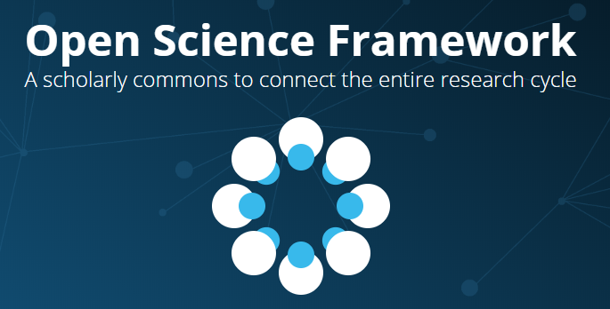
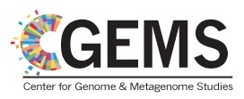
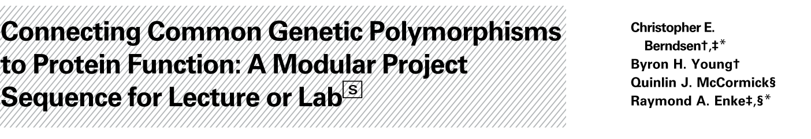
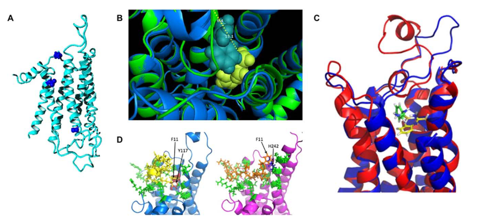
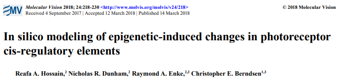
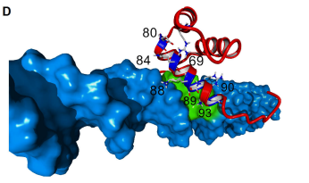
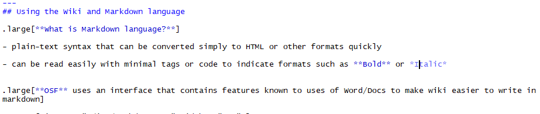
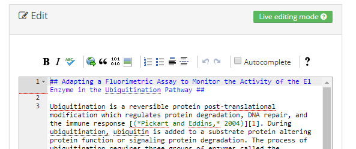

```{r setup, include=FALSE}
options(htmltools.dir.version = FALSE)
library(ggplot2)
```


# Using the Open Science Framework

- .Large[Research lab project and data management]

- .Large[Lecture-based research experience for undergraduates]

- .Large[Project management of the CGEMS site]

.pull-left[



]

.pull-right[



]


---

## Research Project Management with undergraduate students

### Problems:

.large[
- Lots of turnover --> Issues with continuity

- Inexperienced --> Need to be shown hows and whys of data management
]
<br/>

<br/>


.center[.content-box-purple[.large[Open Science Framework can mitigate these issues!]]]

---
# General setup for lab projects

.Large[Each project has a site]

- Students are added as contributors with "read + write" access

- Components delineate experiments or research areas

    - *Makes it easier to make specific parts of a project public later*

.Large[Procedures and Final results are displayed in the wiki]

- Intermediate or other results are included in component folders with data/experiment titles

- **Try** to keep analysis and results files in distinct folders

.Large[*Mendeley/Zotero* reference area]

.Large[Link in other resources like *Github* or *Dropbox* as needed]

---
class: center, middle

# Examples from the Berndsen lab

<br/>

<br/>

.Large[
Publicly available project:

[Tetherin SNP modeling](https://osf.io/hwkj4/)
]
---

## Summary

.large[
**OSF** provides a flexible framework for project management

- Provides data storage and management

- Continuity of techniques and project knowledge

**Wiki panes** are useful as notebooks for describing data and protocols

**Reference panes** make important papers part of the project
]

---
class: center, inverse, middle


# Lecture-based research experience for undergraduates

---

## How to get students to apply and retain knowledge? 

.large[
- Active learning or engaging the student to participate in the learning process aids in understanding and retention

    + Lab courses are often use to supplement learning from the lecture
    
    + POGIL or flipped classrooms: students work on a project to apply knowledge and content to demonstrate concept

- Promote critical thinking and adaptability --> Scientific process

- Teach students to communicate scientific material effectively
]
---

## Course-embedded Undergraduate Research Experience

.large[
- Research project that integrates into the course curriculum to reinforce learning objectives

- Examples at JMU:

    + Intro Biology Lab sequence 
    
    + Organic Chemistry Lab for Chemistry majors
]    
<br/>

.center[.full-width[.content-box-gold[.Large[What about for a lecture course?]]]]

---

## Biochemistry (CHEM361) at JMU

.large[
- Lecture of 55 to 130 students with one/two instructor(s)
- ~70% students have no prior research experience 

    + *Ranges from 50 to 95%*
    
- Mostly non-chemistry majors 

    + *Biology, Health Science, Biotechnology*
    
- Diverse professional goals 

    + *~1/3 to professional school, 1/3 graduate school, 1/3 job or other*
]
---

## Problems to solve when I started...

.large[
- **Large lecture section** with no associated lab course

- **Materials and infrastructure** to facilitate student interactions and active learning

- **Diverse student backgrounds, abilities, and interests**

- **Management** of the student data

- **Wanted students to think about biochemistry!**
]
---

## My solutions

.large[
- Large lecture section with no associated lab course

    + **POGIL-stylebased classroom activities and used Socrative to monitor students in real time and give feedback**

- Materials and infrastructure to facilitate student interactions and active learning

    + **Used Canvas to facilitate peer groups, Socrative to check answers, in-class activities**
    
- Diverse student backgrounds, abilities, and interests

    + **By lecturing less, I spent more time talking to students in small groups or one-on-one**
]
---
## My solutions continued

.large[
- Management of the student data

    + **Word --> Sharepoint/OneNote --> Open Science Framework**
    
- Wanted students to think about biochemistry!

    + **Course-based project connecting DNA sequence to protein structure/function**
]
---
## Published results from the course-based activity

.pull-left[





.footnote[
[Berndsen, et al., 2016](https://iubmb.onlinelibrary.wiley.com/doi/abs/10.1002/bmb.20976)
]

]

.pull-right[





.footnote[
[Hossain, et al., 2018](http://www.molvis.org/molvis/v24/218/)
]

]

---

## General setup of the CURE project

.pull-left[
.large[**Instructor assigns:**]

- A part of a target protein to analyze

- Templates for online notebook and final report

- Brief review of field, question, and direction to follow

- List of possible online tools to use

- Access to Open Science Framework project folder

]

.pull-right[
.large[**Students then:**]

- Predict changes in weak interactions, pK<sub>A</sub> values, broader changes in protein structure or active site

- Rationalize why the change could occur based on biochemical knowledge

- Connect to protein function/human disease

- Propose how the conclusions could be supported with “real” experiments

]

---

## Open Science Framework

.large[
- Tried asking students to keep a notebook using **Word/Docs** --> .Large[:(]

- Used JMU's access to Sharepoint and **OneNote** --> .Large[:(]

    - ~10% of students could not get access to OneNote
    
    - Was a good solution otherwise
    
- Present solution is the **Open Science Framework**
]
---

## Two ways to manage student notebooks

.large[**1. Fork and go do Science (2016-2018)**]


.large[**2. Research Community (going forward)**]


---
## Fork and go do Science (2016-2018)


```{r fork, echo=FALSE, warning=FALSE, message=FALSE, fig.align='center'}
ggplot() +
  annotate("rect", xmin = 4.5, xmax = 9.5, ymin = 3, ymax = 8, fill = "dark cyan") +
  annotate("rect", xmin = 9, xmax = 11, ymin = 0, ymax = 2, fill = "red") +
  annotate("rect", xmin = 3, xmax = 5, ymin = 0, ymax = 2, fill = "red") +
  annotate("rect", xmin = 6, xmax = 8, ymin = 0, ymax = 2, fill = "red") +
  annotate("rect", xmin = 12, xmax = 14, ymin = 3, ymax = 5, fill = "red") +
  annotate("rect", xmin = 12, xmax = 14, ymin = 6, ymax = 8, fill = "red") +
  annotate("rect", xmin = 9, xmax = 11, ymin = 9, ymax = 11, fill = "red") +
  annotate("rect", xmin = 6, xmax = 8, ymin = 9, ymax = 11, fill = "red") +
  annotate("rect", xmin = 3, xmax = 5, ymin = 9, ymax = 11, fill = "red") +
  annotate("rect", xmin = 0, xmax = 2, ymin = 3, ymax = 5, fill = "red") +
  annotate("rect", xmin = 0, xmax = 2, ymin = 6, ymax = 8, fill = "red") +
  annotate("segment", x = 5, xend = 4, y = 3, yend = 2, size = 2, linetype = "dotted") +
  annotate("segment", x = 7, xend = 7, y = 3, yend = 2, size = 2, linetype = "dotted") +
  annotate("segment", x = 8.75, xend = 10, y = 3, yend = 2, size = 2, linetype = "dotted") +
  annotate("segment", x = 9.5, xend = 12, y = 4, yend = 4, size = 2, linetype = "dotted") +
  annotate("segment", x = 9.5, xend = 12, y = 7, yend = 7, size = 2, linetype = "dotted") +
  annotate("segment", x = 5, xend = 4, y = 8, yend = 9, size = 2, linetype = "dotted") +
  annotate("segment", x = 7, xend = 7, y = 8, yend = 9, size = 2, linetype = "dotted") +
  annotate("segment", x = 8.75, xend = 10, y = 8, yend = 9, size = 2, linetype = "dotted") +
  annotate("segment", x = 4.5, xend = 2, y = 4, yend = 4, size = 2, linetype = "dotted") +
  annotate("segment", x = 4.5, xend = 2, y = 7, yend = 7, size = 2, linetype = "dotted") +
  annotate("text", x = 7, y = 5, label = 'bold("Central \nOSF \nProject")', size = 6, parse = TRUE, color = "black") +
  annotate("text", x = 13, y = 9.5, label = 'bold("Individual \nProjects")', size = 6, parse = TRUE, color = "red") +
  theme_void()

```

---
## Fork and go do Science (2016-2018)

- Instructor creates a public base notebook and populates with necessary materials
    
- Students "fork" project and give the instructor access

.pull-left[

.bold[.large[What works:]]

- All the data can be kept in a central place

- Easy to see when students did the work

- No access problems

- Students have freedom to manage project as they wish

]

.pull-right[

.bold[.large[What needed improvement:]]
- Creates a lot of divergent notebooks

- Hard to distribute new information to all the projects

- Students have freedom to manage project as they wish

]

---
## Research Community


```{r collab, echo=FALSE, warning=FALSE, message=FALSE, fig.align='center'}
ggplot() +
  annotate("rect", xmin = 0, xmax = 60, ymin = -1, ymax = 5.5, fill = "dark cyan") +
  annotate("rect", xmin = 20, xmax = 55, ymin = 0.1, ymax = 1, fill = "blue") +
  annotate("rect", xmin = 20, xmax = 55, ymin = 1.1, ymax = 2, fill = "blue") +
  annotate("rect", xmin = 20, xmax = 55, ymin = 2.1, ymax = 3, fill = "blue") +
  annotate("rect", xmin = 20, xmax = 55, ymin = 3.1, ymax = 4, fill = "blue") +
  annotate("rect", xmin = 20, xmax = 55, ymin = 4.1, ymax = 5, fill = "blue") +
  annotate("rect", xmin = 40, xmax = 50, ymin = 0.1, ymax = .5, fill = "red") +
  annotate("rect", xmin = 40, xmax = 50, ymin = .6, ymax = 1, fill = "red") +
  annotate("rect", xmin = 40, xmax = 50, ymin = 1.1, ymax = 1.5, fill = "red") +
  annotate("rect", xmin = 40, xmax = 50, ymin = 2.6, ymax = 3, fill = "red") +
  annotate("rect", xmin = 40, xmax = 50, ymin = 3.1, ymax = 3.5, fill = "red") +
  annotate("rect", xmin = 40, xmax = 50, ymin = 3.6, ymax = 4, fill = "red") +
  annotate("rect", xmin = 40, xmax = 50, ymin = 4.1, ymax = 4.5, fill = "red") +
  annotate("rect", xmin = 40, xmax = 50, ymin = 4.6, ymax = 5, fill = "red") +
  annotate("rect", xmin = 40, xmax = 50, ymin = 1.6, ymax = 2, fill = "red") +
  annotate("rect", xmin = 40, xmax = 50, ymin = 2.1, ymax = 2.5, fill = "red") +
  annotate("rect", xmin = 5, xmax = 10, ymin = 0.5, ymax = 1.5, fill = "black") +
  annotate("rect", xmin = 5, xmax = 10, ymin = 4.0, ymax = 5.0, fill = "magenta") +
  annotate("text", x = 7, y = 6.25, label = 'bold("Central OSF \nProject")', size = 6, color = "dark cyan", parse = TRUE) +
  annotate("text", x = 27, y = 6, label = 'bold("Group \nProject \nComponents")', color = "blue", size = 6, parse = TRUE) +
  annotate("text", x = 45, y = 6, label = 'bold("Individual \nProject \nComponents")', size = 6, color = "red", parse = TRUE) +
   annotate("text", x = 8, y = 0, label = 'bold("References")', size = 6, color = "black", parse = TRUE) +
  annotate("text", x = 8, y = 2.7, label = 'bold("Project \nResources")', size = 6, color = "magenta", parse = TRUE) +
  ylim(-2,8) +
  theme_void()

```


---
## Research Community

- Instructor creates a project and populates with necessary materials

- Students ask to be contributors

.pull-left[

.bold[.large[Group Project:]]

- Students in groups create component

    - research background on target gene/protein
    
    - Use wiki to illustrate the known aspects of gene/protein
    
- Learn to use OSF and visualization software together

]

.pull-right[

.bold[.large[Individual Project:]]

- Within group component, students create research component for their part of the research

    - Data repository for individual project and notebook
    
    - Use wiki to highlight results like a notebook
    
- Students see how others solved similar problems
    
]

---

## Summary

.large[
**Lecture based research project** for biochemistry


**OSF** facilitates data management and storage


**In the future**, OSF will be the hub for the students working to learn and collaborate on their research project.
]

---
class: center, inverse, middle
# Making the CGEMS workshop site


---
## Using the Wiki and Markdown language

.large[**What is Markdown language?**]

- plain-text syntax that can be converted simply to HTML or other formats quickly

- can be read easily with minimal tags or code to indicate formats such as **Bold** or *Italic*


.large[**OSF** uses an interface that contains features known to uses of Word/Docs to make wiki easier to write in markdown]


.center[]


.footnote[(This entire presentation was written in a version of markdown)]
    
---

## OSF interface for the Wiki

.center[]

'##' indicates a header

'*' on either side of a word or phrase converts to italics

'**' on either side of a word or phrase converts to bold

.large[While you type, you can preview the result of the markdown to HTML conversion]

---
class: center, middle

# Let's make a wiki page

---
## Group work

.large[
In groups we will:

1. Create a component for each part of the workshop

2. Begin to fill in the wiki using markdown language
]